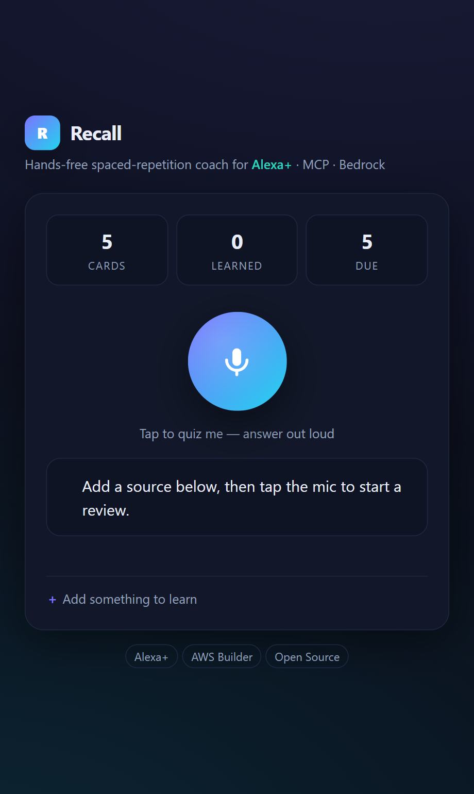
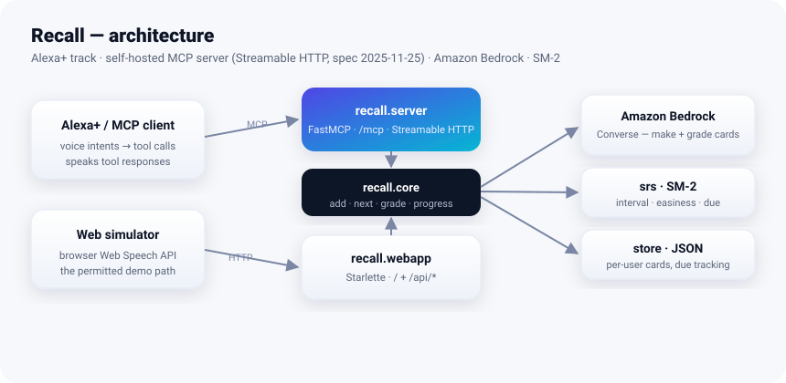

# Recall — a hands-free spaced-repetition learning coach for Alexa+

> **Merged:** Recall now lives in **[senih25/hermx-proofgate-amazon-2026](https://github.com/senih25/hermx-proofgate-amazon-2026)** as *HERMX ProofGate: Recall*, the single submission for the Build, Ship, Shape hackathon. Live demo: https://hermx-proofgate-recall.senih-bayankulu25.workers.dev. This repository is the earlier prototype and is no longer updated.

[](LICENSE)

> Turn what you read into voice-quizzed mastery. Feed Recall your notes, docs,
> or a topic; it builds flashcards and coaches you hands-free through Alexa+ on
> an SM-2 spaced-repetition schedule.

Built for the **Build, Ship, Shape: Amazon Developer Hackathon** — Alexa+ track,
with the **AWS Builder** and **Open Source** mini challenges.

<p align="center">
  
</p>

## How it fits the tracks

| Requirement | How Recall meets it |
| --- | --- |
| **Alexa+ track** — self-hosted MCP server, spec **2025-11-25+**, Streamable HTTP | `recall/server.py` runs a `FastMCP` server on `streamable-http`; `initialize` negotiates protocol `2025-11-25`. |
| **AWS Builder mini** | `recall/bedrock.py` calls **Amazon Bedrock** (Claude, Converse API) for flashcard generation and free-text answer grading. |
| **Open Source mini** | MIT-licensed, public repo, this contribution. |

## Architecture



<details><summary>Text version</summary>

```
Alexa+  ──MCP (Streamable HTTP)──►  recall.server (FastMCP)
                                       │
                 ┌─────────────────────┼─────────────────────┐
                 ▼                     ▼                       ▼
          bedrock.py             srs.py (SM-2)            store.py (JSON)
      Bedrock Converse:     next interval / easiness    per-user cards,
      make + grade cards      from recall grade          due tracking
```

</details>

The SM-2 scheduler is real logic, not an LLM wrapper: recall grades (0–5) drive
the easiness factor and interval so hard cards resurface and mastered cards fade
out. Bedrock supplies the language understanding (turning source text into cards,
grading a spoken answer); if AWS credentials are absent the server falls back to
a deterministic heuristic so it still runs locally.

## MCP tools

| Tool | Purpose (spoken-first responses) |
| --- | --- |
| `add_source(text, topic, count)` | Generate flashcards from a chunk of text. |
| `next_review()` | Get the next due card's question to read aloud. |
| `grade(card_id, answer)` | Grade a spoken answer, reschedule via SM-2. |
| `progress()` | Speak a recap: total / learned / due. |

## Run locally

```bash
pip install -r requirements.txt
python -m recall.server          # MCP: Streamable HTTP on http://127.0.0.1:8000/mcp
python -m recall.webapp          # Alexa+ voice simulator on http://127.0.0.1:8080
```

The MCP server is the Alexa+ track integration; the web app is the permitted
Alexa+ **experience simulator** (browser Web Speech API). Both call the same
`recall/core.py` logic. See [`docs/`](docs/) for the Alexa+ integration guide,
demo script, friction log, and submission draft.

Smoke test the transport:

```bash
curl -s -X POST http://127.0.0.1:8000/mcp \
  -H "Content-Type: application/json" \
  -H "Accept: application/json, text/event-stream" \
  -d '{"jsonrpc":"2.0","id":1,"method":"initialize","params":{"protocolVersion":"2025-11-25","capabilities":{},"clientInfo":{"name":"smoke","version":"0"}}}'
```

### AWS Bedrock (AWS Builder mini)

Set credentials and a model id; the server uses the Bedrock Converse API:

```bash
export AWS_REGION=us-east-1
export BEDROCK_MODEL_ID=anthropic.claude-3-5-sonnet-20241022-v2:0
# standard AWS credential chain (env, profile, or role)
```

## Tests

```bash
python recall/srs.py         # SM-2 scheduler self-check
python recall/store.py       # persistence self-check
python recall/bedrock.py     # offline grading/generation fallback
PYTHONPATH=. python tests/test_flow.py   # end-to-end add → review → grade
```

## License

MIT — see [LICENSE](LICENSE).
